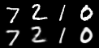
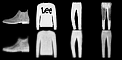

# Variational AutoEncoder Implementation & Extension

## Duration
24.08 – 24.10. (VAE baseline → Conv extension → Reconstruction analysis)

## Objective
fc layer만으로 구성된 Baseline VAE 구현 후 Convolutional 구조 확장을 통해 reconstruction 품질 개선 가능성을 실험하였습니다.

---

## 1. Baseline VAE
- Fully-connected encoder/decoder
- MNIST dataset
- Standard ELBO loss

---

## 2. Conv-VAE Extension
- Convolutional encoder/decoder
- Spatial feature extraction 강화

---

## 3. Results & Observed Issue

Conv 구조 적용 후 fc 기반 모델과 비교해 reconstruction blur 현상이 발생하였습니다.

---

## 4. Investigation

Possible causes:
- KL divergence weight imbalance
- Posterior collapse
- Decoder capacity limitation
- Latent dimension sensitivity

Experiments:
- β-VAE 실험
- Latent dimension 조정
- Reconstruction loss 비교

---

## 5. Key Insight

Conv 구조가 항상 reconstruction sharpness를 보장하지는 않으며,
KL-regularization과 reconstruction loss 간에 trade-off 존재함을 발견하였습니다.